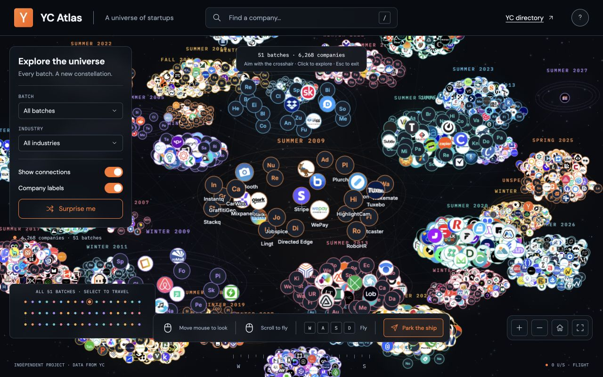

# YC Atlas

[Explore the live universe](https://yc-atlas1.vercel.app/)

Fly through the Y Combinator company universe. Explore **6,268 companies across 51 batches**, discover their logos and descriptions, and open their websites.

A lightweight app built with React, TypeScript, Vite, and a native Canvas renderer. No backend, database, or API keys required.

## Run locally

```sh
npm ci
npm run dev
```

Open [127.0.0.1:5173](http://127.0.0.1:5173/).

## Explore

- Search for a company or select a batch to travel to it.
- Drag and scroll to explore the overview.
- **Enter flight** to see every batch and company. **W/S** flies forward/back, **A/D** strafes, **Q/E** rises/descends, and **Shift** boosts speed.
- Move the mouse to look. The fixed center crosshair is your flight cursor; click to open the company beneath it. Flight pauses while its website and YC profile options are open, with all logos and your position preserved. Close the details or choose **Resume flight** to continue.
- Press **Esc** to exit flight and restore the normal mouse.
- Open company details to visit its website or YC profile. Missing logos use initials.

## Build and test

```sh
npm run build   # Static site in dist/
npm run preview # Preview the production build
npm test        # Eight tests for data, projection, flight, and links
```

Use Node.js with built-in TypeScript support to run the tests. Deploy `dist/` to any static host.

## Data

Bundled directory snapshot: **October 1, 2026**, from the [unofficial YC OSS API](https://github.com/yc-oss/api). Logos load as you explore; featured logos are cached locally. Connections represent shared batches and the cohort timeline. This project is independent of Y Combinator.

Refresh the directory with `npm run refresh-data`, then update cached logos with `node scripts/cache-logos.mjs`.
